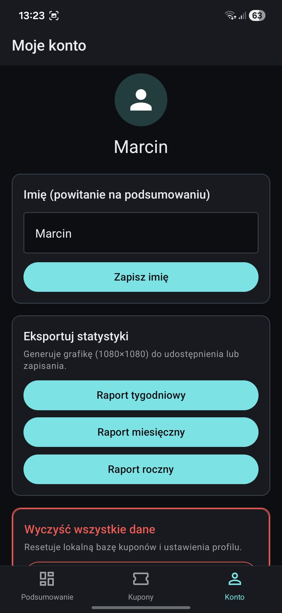

# Asystent Bukmachera 📈

Prosta aplikacja mobilna ułatwiająca śledzenie zawartych zakładów bukmacherskich, kontrolowanie budżetu oraz analizę statystyk (bilans, ROI). 

> **Uwaga:** Jest to moja pierwsza aplikacja mobilna. Projekt powstał głównie do użytku własnego, w celach edukacyjnych i jest w stałym rozwoju. Kod i funkcjonalności będą z czasem refaktoryzowane i ulepszane.

## 📸 Zrzuty ekranu

  
  
  

## ✨ Główne funkcjonalności

- **Zarządzanie kuponami:** Dodawanie, edycja (zmiana statusu na wygrany/przegrany) i usuwanie kuponów.
- **Statystyki na żywo:** Obliczanie całkowitego bilansu, sumy stawek, wygranych oraz wskaźnika ROI.
- **Wizualizacja danych:** Interaktywny wykres liniowy pokazujący zyski i straty w czasie.
- **Filtrowanie:** Przeglądanie danych z podziałem na status (w grze, wygrane, przegrane) oraz czas (ten tydzień, miesiąc, rok).
- **Generowanie raportów:** Możliwość wygenerowania kwadratowej grafiki ze statystykami i udostępnienia jej w social mediach.
- **Lokalna baza danych:** Wszystkie informacje są bezpiecznie zapisywane bezpośrednio na urządzeniu użytkownika.

## 🛠️ Technologie

Aplikacja została zbudowana przy użyciu nowoczesnego ekosystemu JavaScript:

- **React Native** (z wykorzystaniem **Expo**)
- **TypeScript** - dla zapewnienia bezpieczeństwa typów
- **React Navigation** - do nawigacji pomiędzy ekranami (Bottom Tabs)
- **React Native Paper** - biblioteka komponentów UI (Material Design)
- **AsyncStorage** - lokalne przechowywanie danych
- **Context API** - zarządzanie stanem aplikacji
- **React Native Chart Kit** - renderowanie wykresów
- **Expo Sharing / View Shot** - tworzenie zrzutów widoku i udostępnianie plików

## 📱 Pobierz aplikację (Plik APK)

Gotowy plik instalacyjny **`.apk`** znajdziesz w sekcji **Releases** po prawej stronie tego repozytorium na GitHubie. Możesz go pobrać bezpośrednio na swój telefon z systemem Android i zainstalować, aby przetestować aplikację na żywo.