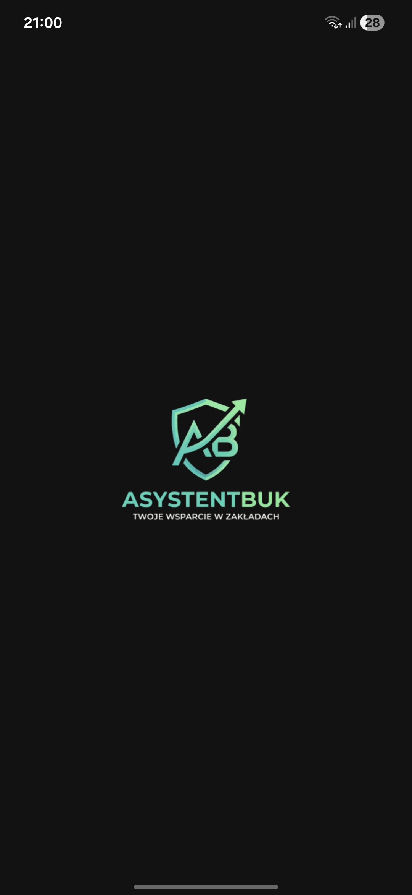
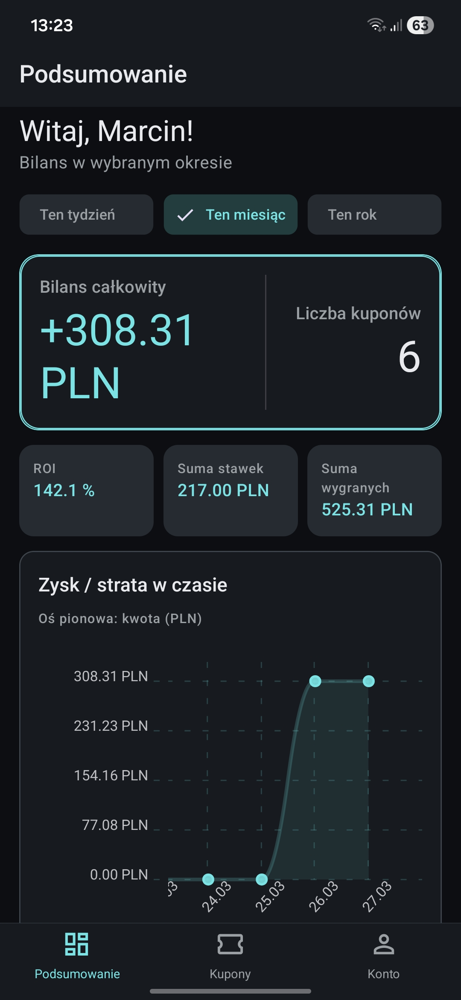
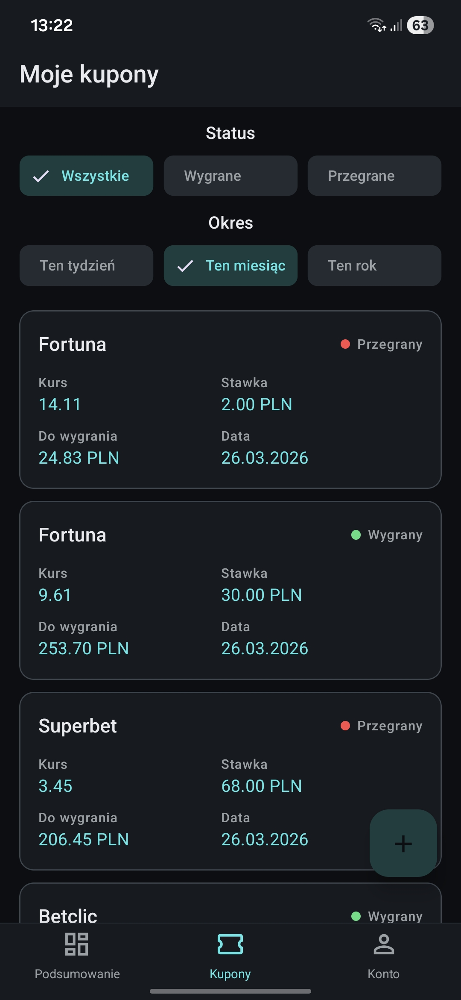
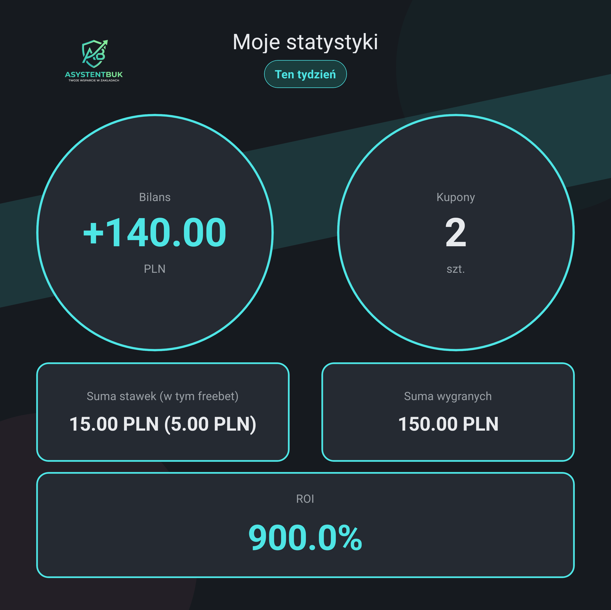

# Asystent Bukmachera 📈

Prosta aplikacja mobilna ułatwiająca śledzenie zawartych zakładów bukmacherskich, kontrolowanie budżetu oraz analizę statystyk (bilans, ROI). 

> **Uwaga:** Jest to moja pierwsza aplikacja mobilna. Projekt powstał głównie do użytku własnego, w celach edukacyjnych i jest w stałym rozwoju. Kod i funkcjonalności będą z czasem refaktoryzowane i ulepszane.

## 📸 Zrzuty ekranu

<table align="center" style="border: none;">
  <tr>
    <td align="center">
       
      <i>1. Ekran Startowy</i>
    </td>
    <td align="center">
       
      <i>2. Ekran podsumowanie</i>
    </td>
  </tr>
  <tr>
    <td align="center">
       
      <i>3. Ekran kupony</i>
    </td>
    <td align="center">
       
      <i>4. Ekran Moje konto</i>
    </td>
  </tr>
</table>

   
  <i>5. Wygenerowany raport</i>

## ✨ Główne funkcjonalności

- **Zarządzanie kuponami:** Dodawanie, edycja (zmiana statusu na wygrany/przegrany) i usuwanie kuponów.
- **Statystyki na żywo:** Obliczanie całkowitego bilansu, sumy stawek, wygranych oraz wskaźnika ROI.
- **Wizualizacja danych:** Interaktywny wykres liniowy pokazujący zyski i straty w czasie.
- **Filtrowanie:** Przeglądanie danych z podziałem na status (w grze, wygrane, przegrane) oraz czas (ten tydzień, miesiąc, rok).
- **Generowanie raportów:** Możliwość wygenerowania kwadratowej grafiki ze statystykami i udostępnienia jej w social mediach.
- **Lokalna baza danych:** Wszystkie informacje są bezpiecznie zapisywane bezpośrednio na urządzeniu użytkownika.

## 🛠️ Technologie

Aplikacja została zbudowana przy użyciu nowoczesnego ekosystemu JavaScript:

- **React Native** (z wykorzystaniem **Expo**)
- **TypeScript** - dla zapewnienia bezpieczeństwa typów
- **React Navigation** - do nawigacji pomiędzy ekranami (Bottom Tabs)
- **React Native Paper** - biblioteka komponentów UI (Material Design)
- **AsyncStorage** - lokalne przechowywanie danych
- **Context API** - zarządzanie stanem aplikacji
- **React Native Chart Kit** - renderowanie wykresów
- **Expo Sharing / View Shot** - tworzenie zrzutów widoku i udostępnianie plików

## 📱 Pobierz aplikację (Plik APK)

Gotowy plik instalacyjny **`.apk`** znajdziesz w sekcji **Releases** po prawej stronie tego repozytorium na GitHubie. Możesz go pobrać bezpośrednio na swój telefon z systemem Android i zainstalować, aby przetestować aplikację na żywo.

---
---

# Betting Assistant 📈

A simple mobile application to easily track sports betting slips, control your budget, and analyze statistics (balance, ROI).

> **Note:** This is my first mobile app. The project was created mainly for personal use and educational purposes, and it is in continuous development. The code and features will be refactored and improved over time.

## 📸 Screenshots

<table align="center" style="border: none;">
  <tr>
    <td align="center">
       
      <i>1. Splash Screen</i>
    </td>
    <td align="center">
       
      <i>2. Main Dashboard</i>
    </td>
  </tr>
  <tr>
    <td align="center">
       
      <i>3. Bets History</i>
    </td>
    <td align="center">
       
      <i>4. My Account</i>
    </td>
  </tr>
</table>

   
  <i>5. Generated Report</i>

## ✨ Main Features

- **Bet Management:** Adding, editing (changing status to won/lost), and deleting bets.
- **Live Statistics:** Calculating total balance, sum of stakes, winnings, and ROI indicator.
- **Data Visualization:** Interactive line chart showing profits and losses over time.
- **Filtering:** Browsing data divided by status (in play, won, lost) and time (this week, month, year).
- **Report Generation:** Ability to generate a square graphic with statistics and share it on social media.
- **Local Database:** All information is securely saved directly on the user's device.

## 🛠️ Technologies

The application was built using a modern JavaScript ecosystem:

- **React Native** (using **Expo**)
- **TypeScript** - for type safety
- **React Navigation** - for screen navigation (Bottom Tabs)
- **React Native Paper** - UI component library (Material Design)
- **AsyncStorage** - local data storage
- **Context API** - application state management
- **React Native Chart Kit** - rendering charts
- **Expo Sharing / View Shot** - capturing views and sharing files

## 📱 Download the app (APK file)

You can find the ready-to-install **`.apk`** file in the **Releases** section on the right side of this GitHub repository. You can download it directly to your Android phone and install it to test the app live.